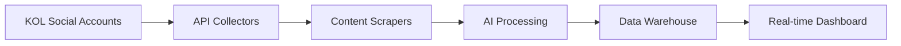

# KOL Profile Enhancement: From Dummy Data to Production Intelligence

## 🎯 Overview
This document outlines the strategy for transforming the current dummy data-driven KOL profile system into a comprehensive, AI-powered intelligence platform that provides real-time insights for content creators.

## 📊 Current Enhanced KOL Signals Implementation

### Platform Metrics
- **YouTube**: `youtube_subscriber_count`, `youtube_engagement_rate`
- **Instagram**: `instagram_follower_count`, `instagram_engagement_rate`
- **Content Topics**: Platform-specific topic analysis
- **Content Frequency**: Posting patterns and consistency

### Trust & Authenticity Indicators
- **Brand Safety Score**: Content appropriateness rating (0-10)
- **Content Authenticity Score**: Genuine vs promotional content ratio
- **Community Sentiment Score**: Audience reaction analysis
- **Fake Follower Percentage**: Bot detection metrics

### Brand Collaboration Intelligence
- **Previous Brand Deals**: Historical partnership data
- **Industries Worked With**: Sector experience mapping
- **Products Advertised**: Product category expertise
- **Average Brand Deal Value**: Market rate benchmarking

### Performance Analytics
- **Engagement Metrics**: Likes, comments, shares per post
- **Viral Content Count**: Content that exceeded engagement thresholds
- **Activity Consistency Score**: Posting schedule reliability
- **Niche Authority Score**: Subject matter expertise rating

## 🚀 Production Implementation Strategy

### Phase 1: API Integration Foundation (Month 1-2)

#### YouTube Data API v3 Integration
```typescript
// Real YouTube metrics collection
const youtubeService = {
  async getChannelMetrics(channelId: string) {
    return {
      subscriberCount: number,
      videoCount: number,
      viewCount: number,
      recentVideos: VideoData[],
      engagementRates: EngagementMetrics
    }
  },
  
  async analyzeContent(videos: VideoData[]) {
    return {
      topicDistribution: TopicAnalysis,
      contentQualityScores: QualityMetrics,
      audienceRetention: RetentionData
    }
  }
}
```

#### Instagram Basic Display API Integration
```typescript
// Instagram metrics and content analysis
const instagramService = {
  async getProfileMetrics(accessToken: string) {
    return {
      followerCount: number,
      mediaCount: number,
      recentPosts: MediaData[],
      storyMetrics: StoryAnalytics
    }
  },
  
  async analyzeEngagement(posts: MediaData[]) {
    return {
      averageLikes: number,
      averageComments: number,
      engagementTrends: TrendData,
      hashtagPerformance: HashtagAnalytics
    }
  }
}
```

### Phase 2: AI-Powered Content Analysis (Month 2-3)

#### Vision LLM Integration for Content Understanding
```typescript
// Advanced content analysis using Vision AI
const contentAnalysisService = {
  async analyzeVideoContent(videoUrl: string) {
    return {
      visualElements: VisualAnalysis,
      audioTranscription: TranscriptData,
      topicExtraction: TopicData,
      brandMentions: BrandAnalysis,
      sentimentAnalysis: SentimentData
    }
  },
  
  async categorizeInfluencer(contentHistory: ContentData[]) {
    return {
      primaryNiches: string[],
      expertiseAreas: ExpertiseMapping,
      contentStyles: StyleAnalysis,
      brandAffinities: BrandAlignment
    }
  }
}
```

#### Multi-Modal AI Pipeline
```typescript
// Comprehensive content processing pipeline
const aiPipeline = {
  async processKOLContent(kolId: string) {
    const [youtube, instagram, brandHistory] = await Promise.all([
      youtubeService.getChannelData(kolId),
      instagramService.getProfileData(kolId),
      brandCollaborationService.getHistory(kolId)
    ])
    
    const analysis = await Promise.all([
      visionAI.analyzeVisualContent(youtube.videos),
      nlpService.analyzeTextContent(instagram.captions),
      sentimentAI.analyzeCommunityFeedback(youtube.comments),
      brandSafetyAI.assessContent(youtube.videos)
    ])
    
    return {
      comprehensiveProfile: KOLIntelligenceData,
      recommendations: OptimizationSuggestions,
      marketValue: ValuationData
    }
  }
}
```

### Phase 3: Advanced Analytics & Predictive Intelligence (Month 3-4)

#### Predictive Performance Modeling
```typescript
// Machine learning for performance prediction
const predictiveAnalytics = {
  async predictCampaignSuccess(kolProfile: KOLData, campaignDetails: CampaignData) {
    return {
      successProbability: number, // 0-100%
      expectedReach: number,
      predictedEngagement: EngagementForecast,
      riskFactors: RiskAssessment,
      optimizationSuggestions: string[]
    }
  },
  
  async generateMarketInsights(industry: string) {
    return {
      trendingTopics: TrendData[],
      optimalPostingTimes: TimeAnalysis,
      competitorBenchmarks: BenchmarkData,
      seasonalPatterns: SeasonalInsights
    }
  }
}
```

#### Audience Quality Verification
```typescript
// Advanced audience authenticity verification
const audienceVerification = {
  async detectFakeFollowers(socialAccounts: SocialAccount[]) {
    return {
      fakeFollowerPercentage: number,
      engagementAuthenticity: AuthenticityScore,
      audienceQualityScore: QualityMetrics,
      suspiciousPatterns: Pattern[]
    }
  },
  
  async analyzeDemographics(audienceData: AudienceData) {
    return {
      ageDistribution: DemographicBreakdown,
      geoDistribution: GeographicData,
      interestMapping: InterestAnalysis,
      purchasingPower: EconomicProfile
    }
  }
}
```

### Phase 4: Real-Time Monitoring & Alerts (Month 4-5)

#### Continuous Data Streaming
```typescript
// Real-time KOL performance monitoring
const realtimeMonitoring = {
  async setupKOLMonitoring(kolId: string) {
    return {
      performanceAlerts: AlertConfig,
      anomalyDetection: AnomalySettings,
      competitorTracking: CompetitorMonitoring,
      trendNotifications: TrendAlerts
    }
  },
  
  async generateRealtimeInsights() {
    return {
      performanceTrends: TrendData,
      contentOpportunities: OpportunityData,
      riskyContent: RiskAlerts,
      brandSafetyUpdates: SafetyStatus
    }
  }
}
```

## 🔧 Technical Architecture

### Data Collection Pipeline


### AI Processing Stack
1. **Vision AI**: Google Cloud Vision, AWS Rekognition
2. **NLP**: OpenAI GPT-4, Google Cloud NLP
3. **Sentiment Analysis**: IBM Watson, Azure Cognitive Services
4. **Brand Safety**: Custom ML models, third-party APIs

### Data Storage Strategy
- **Time-series data**: InfluxDB for performance metrics
- **Graph database**: Neo4j for relationship mapping
- **Document store**: MongoDB for content analysis
- **Relational**: PostgreSQL for structured business data

### Privacy & Compliance
- **Data Encryption**: AES-256 for sensitive financial data
- **Access Control**: Role-based permissions with audit trails
- **GDPR Compliance**: Right to deletion and data portability
- **API Rate Limiting**: Respect platform API limits

## 📈 Business Value Propositions

### For KOLs
1. **Market Value Optimization**: Real-time market rate insights
2. **Content Strategy Guidance**: AI-powered content recommendations
3. **Brand Safety Assurance**: Proactive risk identification
4. **Performance Benchmarking**: Industry comparison metrics

### For Brands
1. **Risk Mitigation**: Comprehensive vetting before partnerships
2. **ROI Prediction**: Data-driven campaign success forecasting
3. **Audience Verification**: Authentic engagement validation
4. **Competitive Intelligence**: Market positioning insights

## 🛡️ Implementation Safeguards

### Data Quality Assurance
- Multi-source verification for critical metrics
- Anomaly detection for data inconsistencies
- Regular calibration against known benchmarks
- Human oversight for AI-generated insights

### Ethical Considerations
- Transparent data usage policies
- Opt-in consent for advanced analytics
- Regular bias auditing of AI models
- Respect for creator privacy boundaries

## 📅 Migration Timeline

### Immediate (Month 1)
- Set up API credentials and basic data collection
- Implement basic YouTube and Instagram metrics
- Create data validation frameworks

### Short-term (Month 2-3)
- Deploy AI content analysis pipeline
- Implement real-time data updates
- Add predictive analytics features

### Medium-term (Month 4-6)
- Full AI-powered insights deployment
- Advanced audience verification
- Competitive intelligence features

### Long-term (Month 6+)
- Market trend prediction
- Automated brand matching
- Advanced risk assessment models

## 🎯 Success Metrics

### Technical KPIs
- **Data Accuracy**: >95% verified metrics
- **Update Frequency**: Real-time to 24-hour refresh
- **API Response Time**: <2 seconds for dashboard loads
- **System Uptime**: 99.9% availability

### Business KPIs
- **Campaign Success Rate**: >80% meet objectives
- **Brand Safety Incidents**: <1% of partnerships
- **KOL Satisfaction**: >4.5/5 platform rating
- **Revenue per KOL**: 25% increase year-over-year
