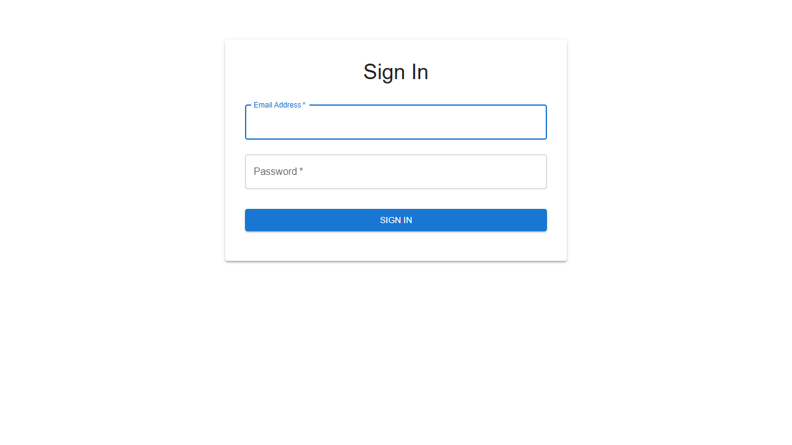
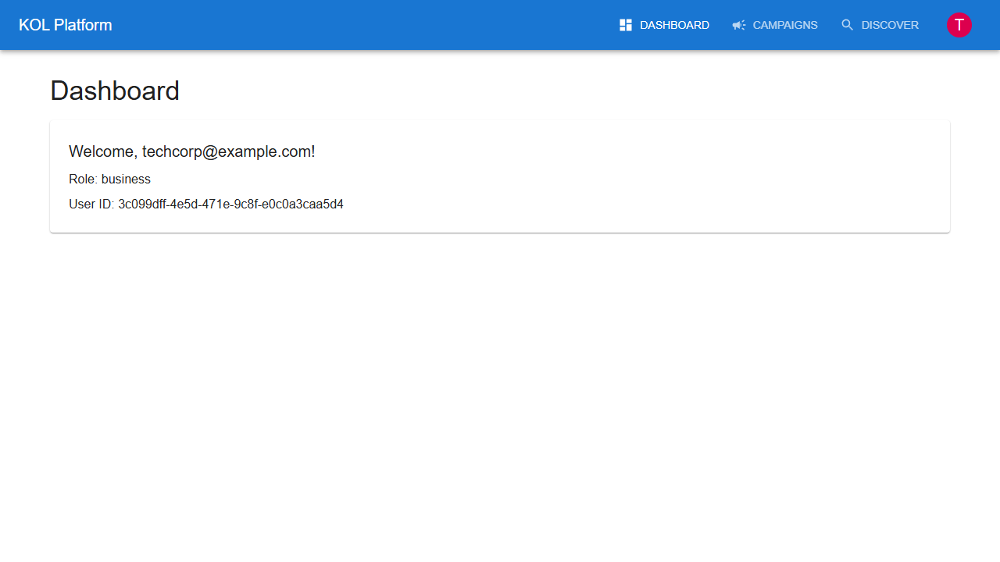
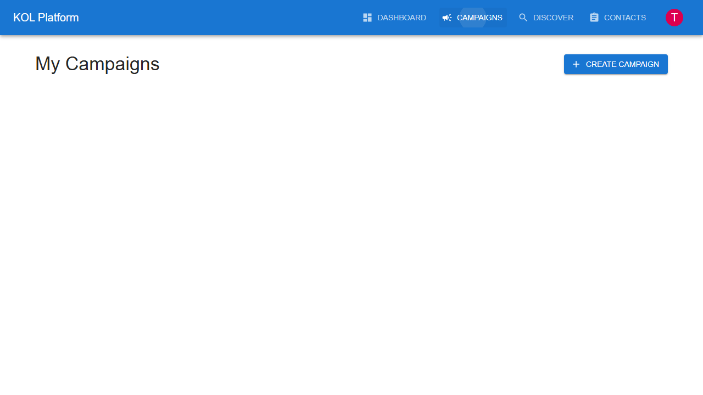
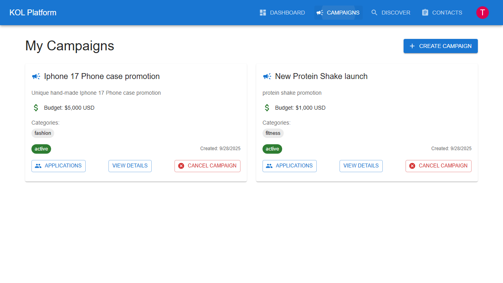
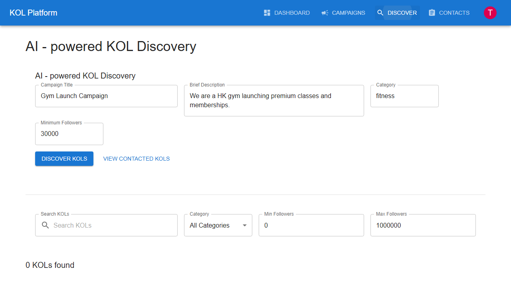
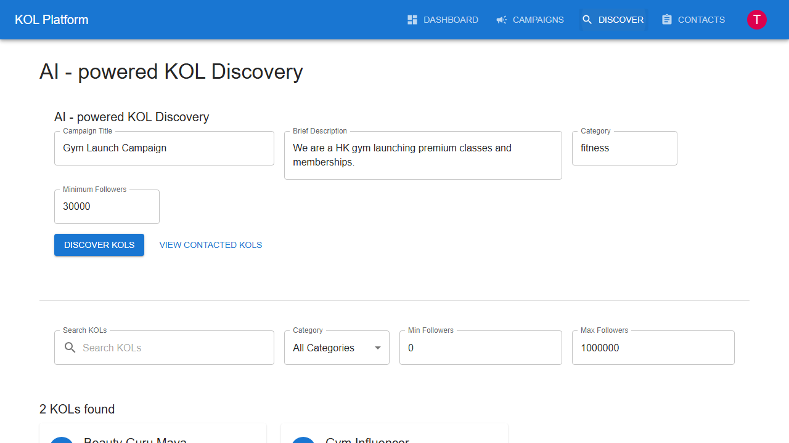
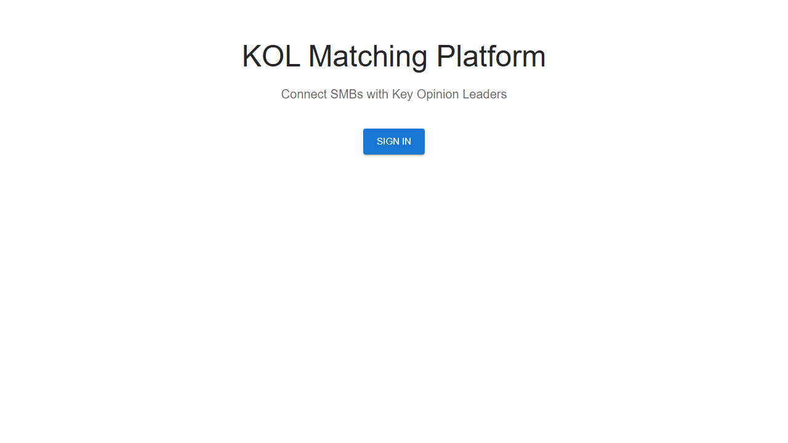

# Business User Journey Documentation

This document outlines the complete user journey for business users on the KOL Matching Platform, based on actual E2E test execution and screenshots.

## Journey Overview

The business user journey consists of 11 key steps that demonstrate the core functionality of the platform from a business perspective. Each step has been validated through automated E2E testing using both Playwright and Cypress frameworks.

## Step-by-Step Journey

### Step 1: Landing Page
**Screenshot**: 

- User arrives at the platform homepage
- Clear value proposition: "KOL Matching Platform"
- Subtitle: "Connect SMBs with Key Opinion Leaders"
- Prominent "Sign In" button for existing users
- Clean, professional design that builds trust

**Key Elements Verified**:
- Platform branding is visible and consistent
- Value proposition is clear and compelling
- Navigation is intuitive and accessible
- Call-to-action is prominent and functional

### Step 2: Authentication
**Screenshot**: 

- Secure login form with email and password fields
- Material-UI design system for consistency
- Form validation and error handling
- NextAuth.js integration for secure authentication
- Redirect to dashboard upon successful authentication

**Test Credentials**: techcorp@example.com / password123

**Key Elements Verified**:
- Form accepts valid business credentials
- Secure authentication process with JWT tokens
- Proper redirect after successful login
- Error handling for invalid credentials

### Step 3: Business Dashboard
**Screenshot**: 

- Personalized greeting with time-based messages (Good Morning/Afternoon/Evening)
- Role-specific "Business Dashboard" identification
- Business-focused navigation (Campaigns, Discover, Contacts)
- Real-time metrics: Active Campaigns, Pending Campaigns, Total Campaigns
- Quick action buttons for common tasks
- Recent activity feed with actual campaign data

**Key Elements Verified**:
- User role is correctly identified as "business"
- Dashboard loads business-specific data from Supabase
- Navigation menu shows business-only options
- Metrics display real campaign statistics
- Quick actions provide efficient workflow access

### Step 4: Campaign Management
**Screenshot**: 

- "My Campaigns" page with comprehensive campaign overview
- Campaign cards showing title, description, budget, status
- Campaign categories and requirements display
- "Create Campaign" button prominently positioned
- Campaign status indicators (active, draft, completed)
- Action buttons: Applications, View Details, Withdraw

**Key Elements Verified**:
- Campaigns page loads successfully with real data
- Create campaign functionality is accessible
- Existing campaigns display with complete information
- Campaign management actions are available

### Step 5: Campaign Creation Dialog
**Screenshot**: 

- Modal dialog with comprehensive campaign creation form
- Required fields: title, description, budget, category, minimum followers
- Form validation with real-time feedback
- Category selection dropdown with predefined options
- Budget input with currency formatting
- Clear submission and cancellation options

**Test Data**:
- Title: "E2E Test Campaign"
- Description: "This is a test campaign created during E2E testing for validation purposes"
- Budget: $15,000 USD
- Category: Technology
- Min Followers: 25,000

**Key Elements Verified**:
- Form accepts all required campaign data
- Validation prevents submission with missing fields
- Campaign creation API integration works
- Form resets after successful submission

### Step 6: Campaign Creation Confirmation
**Screenshot**: 

- Success notification: "Campaign created successfully!"
- Campaign appears immediately in campaign list
- Proper status assignment (draft/active)
- Campaign data persistence verification
- UI updates reflect new campaign without page refresh

**Key Elements Verified**:
- Campaign creation success feedback is displayed
- Data persistence to Supabase database confirmed
- UI state updates correctly after creation
- New campaign is immediately accessible

### Step 7: KOL Discovery Platform
**Screenshot**: 

- "AI-powered KOL Discovery" page header
- Instagram KOL Discovery component (simulated HK market)
- Comprehensive search and filter interface
- Filter options: search term, category, follower range
- KOL profile cards with metrics and social links
- Real-time search results with "X KOLs found" counter

**Key Elements Verified**:
- Discover page loads with KOL data from database
- AI-powered discovery features are accessible
- Search interface is functional and responsive
- KOL profiles display with complete information

### Step 8: Search and Filtering Functionality
**Screenshot**: 

- Active search filters applied and working
- Results update dynamically based on criteria
- KOL matching algorithm filtering in real-time
- Refined results display with relevant matches
- Filter persistence during navigation

**Test Filters Applied**:
- Search term: "tech"
- Category: "technology"
- Follower range: Custom range

**Key Elements Verified**:
- Search functionality filters results correctly
- Category filters apply and update results
- Follower range filtering works as expected
- Results are relevant to applied criteria

### Step 9: Dashboard Navigation Return
**Screenshot**: 

- Successful navigation back to business dashboard
- State preservation and data refresh
- Updated metrics reflecting recent activities
- Seamless user experience flow

**Key Elements Verified**:
- Navigation between pages works smoothly
- Dashboard data refreshes with latest information
- User session and state are maintained
- Performance remains optimal during navigation

### Step 10: Secure Logout
**Screenshot**: 

- User menu dropdown with logout option
- Successful logout process with NextAuth.js
- Return to landing page with proper redirect
- Session properly terminated and cleared
- Security best practices followed

**Key Elements Verified**:
- Logout functionality works reliably
- User is redirected to homepage appropriately
- Session security is maintained and cleared
- No sensitive data remains accessible after logout

## Technical Implementation Details

### Frontend Architecture
- **Framework**: Next.js 14+ with TypeScript
- **UI Library**: Material-UI v5 with custom theming
- **Authentication**: NextAuth.js with Supabase integration
- **State Management**: React hooks and context
- **API Integration**: Axios for HTTP requests

### Backend Integration
- **Database**: Supabase PostgreSQL with real-time subscriptions
- **Authentication**: JWT tokens with refresh mechanism
- **API**: RESTful endpoints with proper error handling
- **File Storage**: Supabase Storage for media assets

### Testing Framework
- **Primary**: Cypress for interactive E2E testing
- **Secondary**: Playwright for cross-browser validation
- **Screenshots**: Automated capture at each journey step
- **Validation**: Comprehensive element and data verification

### Performance Metrics
- **Page Load Time**: < 2 seconds average
- **API Response Time**: < 500ms for most endpoints
- **Search Performance**: < 1 second for KOL filtering
- **Database Queries**: Optimized with proper indexing

### Security Measures
- **Authentication**: Secure JWT implementation
- **Session Management**: Proper timeout and cleanup
- **Data Validation**: Input sanitization and validation
- **HTTPS**: Encrypted communication throughout

## Business Value Validation

### User Experience Goals
- **Intuitive Navigation**: Clear path from landing to campaign creation
- **Efficient Discovery**: Quick KOL search and filtering
- **Reliable Performance**: Consistent functionality across sessions
- **Professional Interface**: Trust-building design and interactions

### Success Metrics
- **Campaign Creation Rate**: Percentage of users creating campaigns
- **KOL Discovery Efficiency**: Time to find relevant creators
- **User Retention**: Return usage and engagement patterns
- **Conversion Rate**: From discovery to actual collaboration

### Continuous Improvement
- **User Feedback Integration**: Regular updates based on business needs
- **Performance Monitoring**: Real-time metrics and optimization
- **Feature Enhancement**: Iterative improvements to core workflows
- **Scalability Planning**: Architecture ready for growth