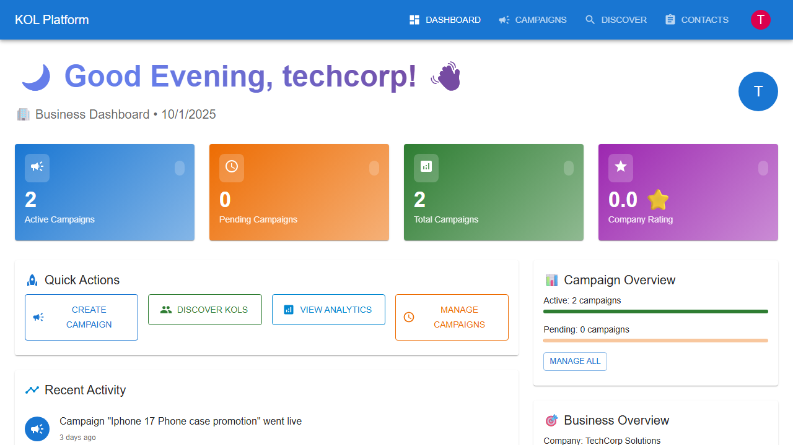

# Business User Journey

This document outlines the complete user journey for business users on the KOL Matching Platform, with screenshots captured during E2E testing.

## Overview
Business users are companies looking to collaborate with Key Opinion Leaders (KOLs) for marketing campaigns. The platform enables them to create campaigns, discover suitable KOLs, and manage collaborations.

## User Journey Steps

### 1. Landing Page
**Objective**: First impression and entry point to the platform

**Key Elements**:
- Platform branding and value proposition
- Clear "Sign In" call-to-action
- Professional design that builds trust

**User Action**: Click "Sign In" to access the platform

---

### 2. Authentication
**Objective**: Secure login to access business features

**Key Elements**:
- Email and password input fields
- Clean, focused login form
- Secure authentication process

**User Action**: Enter credentials (techcorp@example.com / password123)

---

### 3. Business Dashboard
**Objective**: Central hub showing account overview and quick actions

**Key Elements**:
- Welcome message with user identification
- Role confirmation (business user)
- Navigation to key features
- Account summary information

**User Action**: Navigate to campaigns or discover KOLs

---

### 4. Campaign Management
**Objective**: View and manage marketing campaigns

**Key Elements**:
- List of existing campaigns
- Campaign status indicators
- "Create Campaign" button for new campaigns
- Campaign cards with key information

**User Action**: Click "Create Campaign" to start new campaign

---

### 5. Campaign Creation
**Objective**: Define campaign requirements and budget

**Key Elements**:
- Campaign title and description fields
- Budget specification
- Target audience requirements
- Category selection
- Minimum follower count

**User Action**: Fill campaign details and submit

---

### 6. Campaign Created
**Objective**: Confirmation of successful campaign creation

**Key Elements**:
- Success confirmation message
- New campaign appears in list
- Campaign status shows as "active"
- Ready for KOL applications

**User Action**: Navigate to discover KOLs for the campaign

---

### 7. KOL Discovery
**Objective**: Find and evaluate potential KOL partners

**Key Elements**:
- Search and filter interface
- KOL cards with key metrics
- Category and follower filters
- Comprehensive KOL profiles

**User Action**: Search and filter KOLs based on campaign needs

---

### 8. Filtered Results
**Objective**: Refined KOL list based on specific criteria

**Key Elements**:
- Search results for "tech" keyword
- Technology category filter applied
- Relevant KOLs matching criteria
- Engagement metrics visible

**User Action**: Review KOL profiles and select candidates

---

### 9. KOL Profile View
**Objective**: Detailed evaluation of potential KOL partner

**Key Elements**:
- Comprehensive KOL information
- Audience demographics
- Engagement statistics
- Content categories
- Social media links

**User Action**: Evaluate fit and initiate collaboration

---

### 10. Session End
**Objective**: Secure logout from the platform

**Key Elements**:
- Successful logout confirmation
- Return to landing page
- Session security maintained

**User Action**: Journey complete

---

## Key Success Metrics

### User Experience Metrics
- **Time to Campaign Creation**: < 3 minutes
- **KOL Discovery Efficiency**: Find relevant KOLs in < 2 minutes
- **Platform Navigation**: Intuitive flow with minimal clicks

### Business Metrics
- **Campaign Creation Rate**: % of users who create campaigns
- **KOL Engagement Rate**: % of discovered KOLs contacted
- **Platform Retention**: Return usage patterns

### Technical Metrics
- **Page Load Times**: < 2 seconds for all pages
- **Search Response Time**: < 1 second for KOL discovery
- **Uptime**: 99.9% availability

## User Feedback Integration

### Common User Requests
1. **Advanced Filtering**: More granular KOL search options
2. **Bulk Actions**: Select multiple KOLs simultaneously
3. **Campaign Templates**: Pre-built campaign structures
4. **Analytics Dashboard**: Campaign performance tracking

### Planned Improvements
1. **AI-Powered Matching**: Automated KOL recommendations
2. **Real-time Chat**: Direct communication with KOLs
3. **Contract Management**: Built-in agreement handling
4. **Payment Integration**: Streamlined payment processing

## Technical Implementation Notes

### E2E Test Coverage
- Complete user journey from landing to logout
- Form validation and error handling
- Navigation and routing verification
- Data persistence across sessions

### Test Data Requirements
- Valid business user credentials
- Sample campaign data
- Mock KOL profiles with realistic metrics
- Proper database state management

### Automation Benefits
- Consistent user experience validation
- Regression testing for new features
- Performance monitoring
- Cross-browser compatibility verification