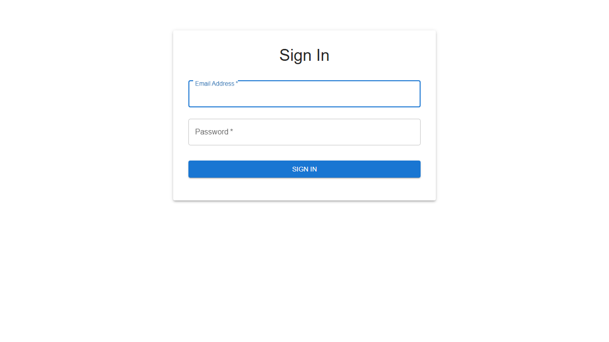
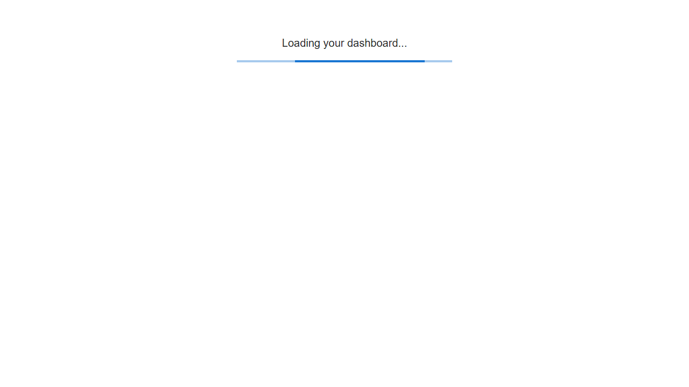
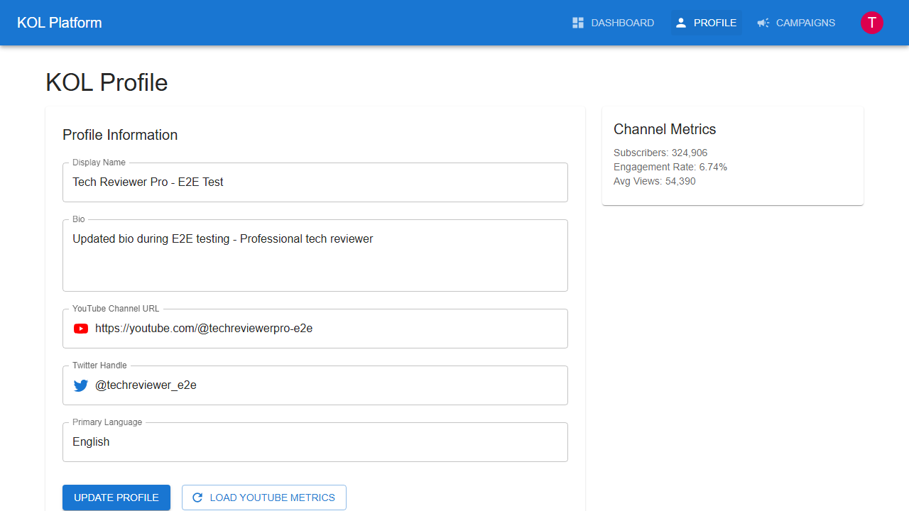
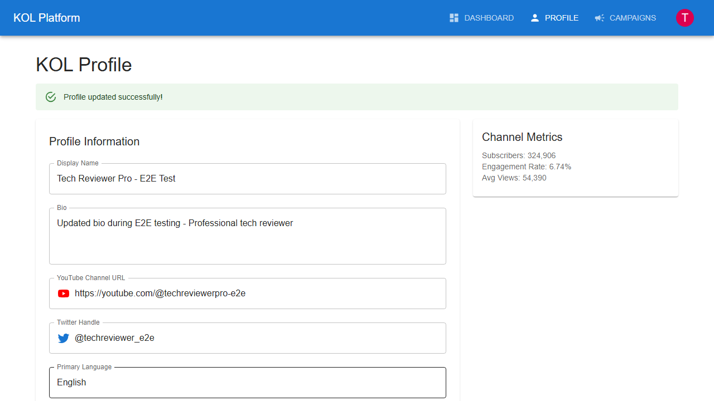
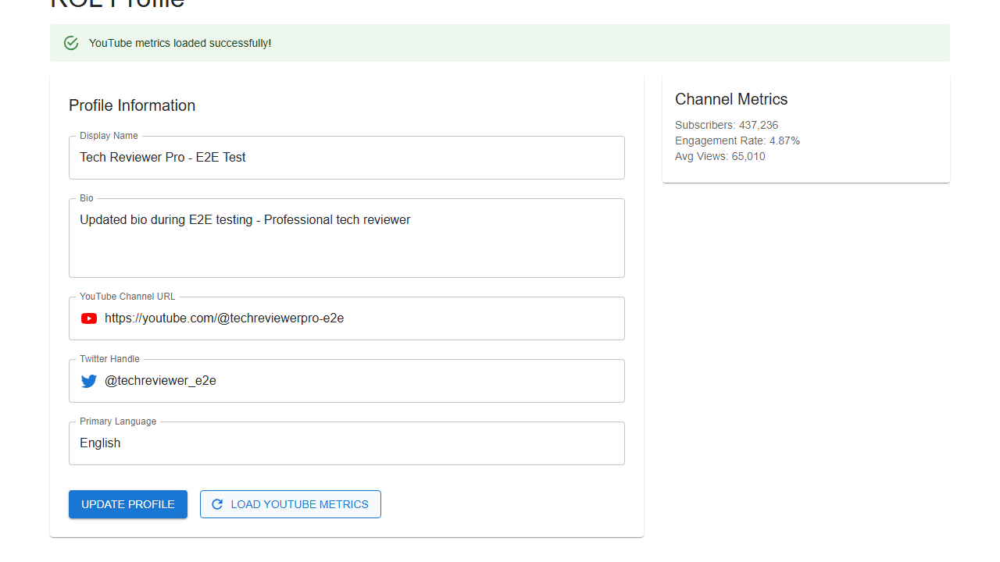
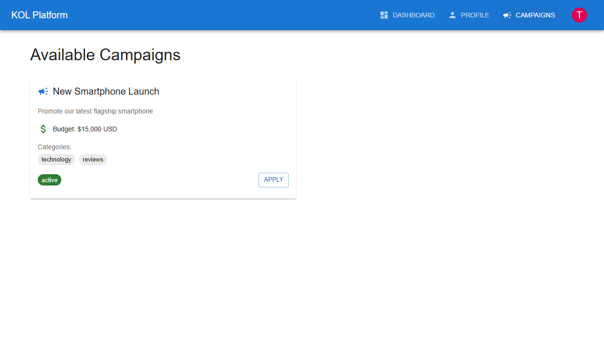
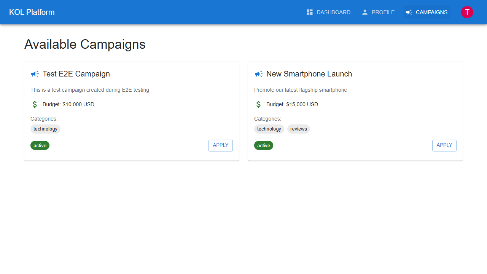
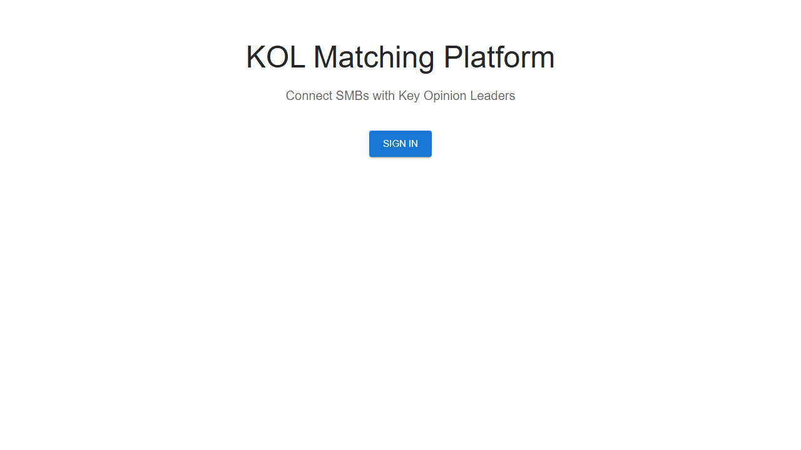

# KOL User Journey

This document outlines the complete user journey for KOL (Key Opinion Leader) users on the KOL Matching Platform, with screenshots captured during E2E testing.

## Overview
KOL users are content creators and influencers who want to monetize their audience through brand partnerships. The platform enables them to manage their profiles, showcase their metrics, and apply to relevant campaigns.

## User Journey Steps

### 1. Landing Page
**Objective**: Platform discovery and initial engagement

**Key Elements**:
- Platform value proposition for creators
- Professional presentation
- Clear entry point for KOLs

**User Action**: Click "Sign In" to access creator features

---

### 2. KOL Authentication
**Objective**: Secure access to creator dashboard

**Key Elements**:
- Same secure login interface
- Email and password authentication
- Consistent user experience

**User Action**: Enter KOL credentials (techreviewer@example.com / password123)

---

### 3. KOL Dashboard
**Objective**: Creator-specific dashboard with relevant features

**Key Elements**:
- Welcome message for KOL user
- Role identification as "kol"
- Access to profile management
- Campaign browsing capabilities

**User Action**: Navigate to profile management or campaign browsing

---

### 4. Profile Management
**Objective**: Comprehensive profile setup and optimization

**Key Elements**:
- Display name and bio editing
- Social media integration (YouTube, Twitter)
- Language specification
- Metrics display area
- Profile update controls

**User Action**: Update profile information to attract brands

---

### 5. Profile Updated
**Objective**: Confirmation of successful profile changes

**Key Elements**:
- Success confirmation message
- Updated profile information visible
- Enhanced profile completeness
- Ready for metric loading

**User Action**: Load YouTube metrics to showcase audience

---

### 6. YouTube Metrics Integration
**Objective**: Showcase audience size and engagement metrics

**Key Elements**:
- Subscriber count display
- Engagement rate metrics
- Average view statistics
- Platform verification
- Audience demographics

**User Action**: Browse available campaigns for collaboration

---

### 7. Campaign Discovery
**Objective**: Find relevant brand collaboration opportunities

**Key Elements**:
- Available campaign listings
- Budget information visible
- Category matching
- Campaign requirements
- Application buttons

**User Action**: Review campaign details and apply

---

### 8. Campaign Application
**Objective**: Apply to relevant brand campaigns

**Key Elements**:
- Detailed campaign information
- Application process initiation
- Requirements verification
- Collaboration terms

**User Action**: Submit application for brand review

---

### 9. Session Completion
**Objective**: Secure logout and session management

**Key Elements**:
- Successful logout confirmation
- Return to public landing page
- Session security maintained

**User Action**: Journey complete, await brand responses

---

## KOL Success Metrics

### Profile Optimization Metrics
- **Profile Completion Rate**: % of fields filled
- **Metric Integration**: YouTube/social media connected
- **Profile Views**: Brand discovery frequency
- **Update Frequency**: Profile maintenance activity

### Campaign Engagement Metrics
- **Application Rate**: % of viewed campaigns applied to
- **Acceptance Rate**: % of applications approved
- **Campaign Completion**: Successful collaboration rate
- **Earnings Growth**: Revenue increase over time

### Platform Usage Metrics
- **Session Duration**: Time spent optimizing profile
- **Return Frequency**: Regular platform engagement
- **Feature Utilization**: Use of all available tools

## KOL Value Proposition

### For Content Creators
1. **Monetization Opportunities**: Direct brand partnerships
2. **Professional Presentation**: Showcase metrics and audience
3. **Streamlined Process**: Easy application and management
4. **Fair Compensation**: Transparent pricing and payments

### For Influencers
1. **Audience Insights**: Detailed demographic data
2. **Brand Matching**: Relevant collaboration opportunities
3. **Portfolio Building**: Track successful campaigns
4. **Growth Tools**: Optimize for brand partnerships

## Profile Optimization Best Practices

### Essential Profile Elements
1. **Professional Display Name**: Clear, brandable identity
2. **Compelling Bio**: Concise value proposition
3. **Verified Metrics**: Authentic audience data
4. **Social Links**: Complete platform presence
5. **Content Categories**: Clear niche identification

### Metric Optimization
1. **Engagement Rate**: Focus on audience interaction
2. **Consistent Content**: Regular posting schedule
3. **Audience Quality**: Relevant, engaged followers
4. **Growth Trends**: Demonstrate upward trajectory

## Campaign Application Strategy

### Application Best Practices
1. **Relevance Matching**: Apply to aligned campaigns
2. **Quick Response**: Apply promptly to new campaigns
3. **Professional Communication**: Clear, concise proposals
4. **Portfolio Presentation**: Showcase relevant past work

### Success Factors
1. **Niche Expertise**: Deep category knowledge
2. **Audience Alignment**: Match brand target demographics
3. **Content Quality**: High production values
4. **Reliability**: Consistent delivery and communication

## Technical Implementation Notes

### E2E Test Coverage
- Complete KOL workflow from login to application
- Profile management and metric integration
- Campaign discovery and application process
- Data persistence and session management

### Test Data Requirements
- Valid KOL user credentials
- Mock YouTube metrics and social data
- Sample campaign opportunities
- Realistic audience demographics

### Automation Benefits
- Consistent creator experience validation
- Profile optimization workflow testing
- Campaign application process verification
- Cross-platform compatibility assurance

## Future Enhancements

### Planned KOL Features
1. **Advanced Analytics**: Deeper audience insights
2. **Content Calendar**: Campaign planning tools
3. **Collaboration Hub**: Direct brand communication
4. **Performance Tracking**: Campaign success metrics

### Platform Improvements
1. **AI Recommendations**: Personalized campaign suggestions
2. **Multi-Platform Integration**: TikTok, Instagram support
3. **Creator Tools**: Content creation assistance
4. **Community Features**: KOL networking opportunities

## Support and Resources

### KOL Onboarding
1. **Profile Setup Guide**: Step-by-step optimization
2. **Best Practices**: Success tips and strategies
3. **Metric Integration**: Platform connection help
4. **Application Tips**: Improve acceptance rates

### Ongoing Support
1. **Help Documentation**: Comprehensive guides
2. **Video Tutorials**: Visual learning resources
3. **Community Forum**: Peer support network
4. **Direct Support**: Platform assistance team