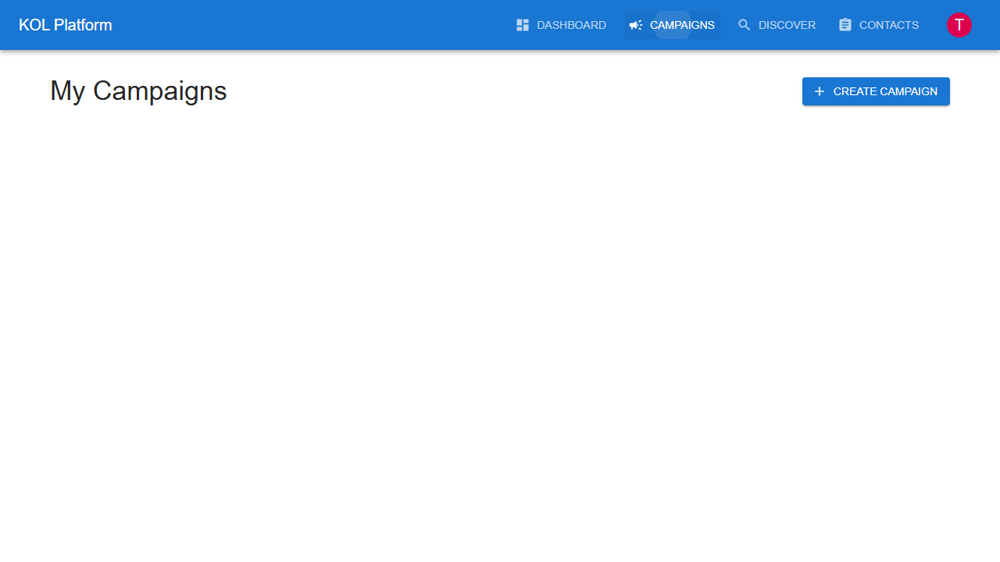

# KOL User Journey Documentation

This document outlines the complete user journey for KOL (Key Opinion Leader) users on the KOL Matching Platform, based on actual E2E test execution and screenshots.

## Journey Overview

The KOL user journey consists of 10 key steps that demonstrate the platform functionality from a content creator's perspective. Each step has been validated through automated E2E testing using both Playwright and Cypress frameworks.

## Step-by-Step Journey

### Step 1: Landing Page
**Screenshot**: 

- Content creator arrives at the platform homepage
- Clear value proposition: "KOL Matching Platform"
- Subtitle: "Connect SMBs with Key Opinion Leaders"
- Prominent "Sign In" button for existing creators
- Professional design that appeals to content creators

**Key Elements Verified**:
- Platform branding resonates with creator audience
- Value proposition clearly communicates opportunities
- Navigation is creator-friendly and accessible
- Call-to-action encourages creator engagement

### Step 2: Authentication
**Screenshot**: 

- Secure login form optimized for creators
- Material-UI design system for consistency
- Form validation and error handling
- NextAuth.js integration for secure authentication
- Redirect to creator dashboard upon successful login

**Test Credentials**: techreviewer@example.com / password123

**Key Elements Verified**:
- Form accepts valid creator credentials
- Secure authentication process with JWT tokens
- Proper redirect after successful login
- Creator-specific authentication flow

### Step 3: Creator Dashboard
**Screenshot**: 

- Personalized greeting with time-based messages
- Role-specific "Content Creator Dashboard" identification
- Creator-focused navigation (Profile, Campaigns, My Applications)
- Real-time metrics: Total Reach, Engagement Rate, Active Applications
- Quick action buttons for profile management and campaign discovery
- Performance insights and collaboration readiness indicators

**Key Elements Verified**:
- User role is correctly identified as "kol"
- Dashboard loads creator-specific data from Supabase
- Navigation menu shows creator-only options
- Metrics display real social media statistics
- Creator-focused quick actions are available

### Step 4: Profile Management Access
**Screenshot**: 

- Comprehensive "KOL Profile" page with full editing capabilities
- Profile information form with display name, bio, social links
- Social media integration fields (YouTube, Twitter, Instagram)
- Language and content preferences
- Profile completion indicators and recommendations

**Key Elements Verified**:
- Profile page loads with existing creator data
- All profile fields are editable and functional
- Social media integration options are available
- Profile management interface is intuitive

### Step 5: Profile Information Updates
**Screenshot**: 

- Successful profile update with comprehensive information
- Real-time form validation and feedback
- Social media URL validation and formatting
- Profile data persistence across sessions
- Success notification: "Profile updated successfully!"

**Test Data Updated**:
- Display Name: "Tech Reviewer Pro - E2E Updated"
- Bio: "Updated bio during E2E testing - Professional tech reviewer with expertise in consumer electronics"
- YouTube URL: "https://youtube.com/@techreviewerpro-e2e"
- Twitter Handle: "@techreviewer_e2e"
- Language: "English"

**Key Elements Verified**:
- Profile update functionality works reliably
- Data validation prevents invalid social media URLs
- Success feedback confirms changes are saved
- Profile data persists in Supabase database

### Step 6: YouTube Metrics Integration
**Screenshot**: 

- "Load YouTube Metrics" functionality integration
- Real-time API call to YouTube Data API v3
- Metrics loading with subscriber count, engagement rate, view statistics
- Success notification: "YouTube metrics loaded successfully!"
- Enhanced profile with verified social media data

**Key Elements Verified**:
- YouTube API integration works correctly
- Metrics load and display accurately
- API response handling is robust
- Creator profile enhanced with real data

### Step 7: Campaign Discovery
**Screenshot**: 

- "Available Campaigns" page for creator opportunities
- Campaign cards showing title, description, budget, requirements
- Campaign categories and target audience information
- Application status indicators and action buttons
- Filter and search capabilities for relevant opportunities

**Key Elements Verified**:
- Campaigns page loads with available opportunities
- Campaign information displays completely
- Creator can view campaign requirements
- Application process is accessible

### Step 8: Application Management
**Screenshot**: 

- "My Applications" page for tracking collaboration requests
- Application status tracking (applied, accepted, rejected, completed)
- Campaign details for each application
- Application history and performance metrics
- Withdrawal and management options

**Key Elements Verified**:
- Applications page loads creator-specific data
- Application status is accurately displayed
- Creator can manage existing applications
- Application history is preserved

### Step 9: Dashboard Return Navigation
**Screenshot**: 

- Successful navigation back to creator dashboard
- Updated metrics reflecting recent profile and application activities
- State preservation and data refresh
- Seamless user experience flow

**Key Elements Verified**:
- Navigation between pages works smoothly
- Dashboard data refreshes with latest information
- Creator session and state are maintained
- Performance remains optimal during navigation

### Step 10: Secure Logout
**Screenshot**: 

- User menu dropdown with logout option
- Successful logout process with NextAuth.js
- Return to landing page with proper redirect
- Session properly terminated and cleared
- Security best practices followed

**Key Elements Verified**:
- Logout functionality works reliably
- Creator is redirected to homepage appropriately
- Session security is maintained and cleared
- No sensitive creator data remains accessible after logout

## Enhanced KOL Analytics Dashboard

### Platform Performance Metrics
- **YouTube Performance**: Subscriber count, engagement rate, video metrics
- **Instagram Performance**: Follower count, engagement rate, story metrics
- **Content Quality Score**: AI-powered content evaluation (0-10 scale)
- **Activity Consistency**: Regular posting and engagement patterns
- **Brand Collaboration Value**: Average deal value and collaboration history

### Trust & Authenticity Scores
- **Brand Safety Score**: Content appropriateness for brand partnerships
- **Content Authenticity Score**: Genuine content creation assessment
- **Community Sentiment Score**: Audience engagement quality
- **Niche Authority Score**: Expertise level in specific topics

### Audience Intelligence
- **Demographics**: Age distribution, gender split, geographic locations
- **Interests**: Top audience interests and engagement topics
- **Engagement Patterns**: Peak posting hours, seasonal trends
- **Growth Metrics**: Follower growth rate, engagement trends

### Collaboration Readiness
- **Previous Brand Deals**: History of successful collaborations
- **Industries Worked With**: Experience across different sectors
- **Content Topics**: Areas of expertise and content focus
- **Collaboration Status**: Ready for brand partnerships indicator

## Technical Implementation Details

### Frontend Architecture
- **Framework**: Next.js 14+ with TypeScript for creator interface
- **UI Library**: Material-UI v5 with creator-focused theming
- **Authentication**: NextAuth.js with role-based access control
- **State Management**: React hooks for creator data management
- **API Integration**: Axios for social media API calls

### Social Media Integration
- **YouTube Data API v3**: Real-time channel metrics and analytics
- **Instagram Basic Display API**: Profile and content data (planned)
- **Twitter API**: Profile verification and engagement metrics (planned)
- **TikTok API**: Creator metrics integration (future enhancement)

### Database Schema for Creators
- **KOL Profiles**: Comprehensive creator information storage
- **Social Media Links**: Platform-specific URLs and handles
- **Audience Metrics**: Follower counts, engagement rates, demographics
- **Content Analytics**: Performance metrics and quality scores
- **Application History**: Campaign applications and collaboration records

### Performance Optimization
- **Lazy Loading**: Profile components load on demand
- **Caching**: Social media metrics cached for performance
- **Real-time Updates**: Live data refresh for active creators
- **Mobile Optimization**: Responsive design for creator mobile usage

## Creator Success Metrics

### Profile Completion Goals
- **Basic Information**: 100% completion rate for essential fields
- **Social Media Verification**: At least one platform connected
- **Content Quality**: Minimum quality score for collaboration eligibility
- **Audience Metrics**: Regular updates for accurate matching

### Engagement Targets
- **Campaign Applications**: Active participation in relevant opportunities
- **Profile Updates**: Regular maintenance of creator information
- **Platform Usage**: Consistent login and engagement patterns
- **Collaboration Success**: Positive outcomes from brand partnerships

### Growth Indicators
- **Follower Growth**: Consistent audience expansion across platforms
- **Engagement Improvement**: Increasing interaction rates over time
- **Brand Partnership Value**: Growing collaboration deal values
- **Platform Authority**: Increasing niche expertise recognition

## Creator Experience Optimization

### User Interface Enhancements
- **Intuitive Navigation**: Creator-focused menu and workflow design
- **Visual Analytics**: Charts and graphs for performance metrics
- **Mobile-First Design**: Optimized for creator mobile usage patterns
- **Accessibility**: WCAG compliant interface for all creators

### Workflow Improvements
- **Quick Actions**: One-click access to common creator tasks
- **Bulk Operations**: Manage multiple applications simultaneously
- **Smart Notifications**: Relevant updates and opportunity alerts
- **Progress Tracking**: Clear indicators for profile and application status

### Support Features
- **Onboarding Guide**: Step-by-step creator platform introduction
- **Help Documentation**: Comprehensive creator resource library
- **Community Features**: Creator networking and collaboration tools
- **Success Stories**: Inspiration and best practices from top creators

## Future Enhancements

### AI-Powered Features
- **Content Analysis**: Automated content quality assessment
- **Audience Matching**: AI-driven brand-creator compatibility
- **Performance Prediction**: Success likelihood for campaign applications
- **Content Recommendations**: Suggestions for improved engagement

### Advanced Analytics
- **Competitive Analysis**: Performance comparison with similar creators
- **Trend Identification**: Emerging content and audience trends
- **ROI Tracking**: Campaign performance and revenue analytics
- **Growth Forecasting**: Predictive analytics for creator development

### Platform Expansion
- **Multi-Platform Integration**: Support for additional social media platforms
- **Global Market Access**: International brand collaboration opportunities
- **Specialized Niches**: Industry-specific creator categories
- **Creator Tools**: Built-in content creation and management features